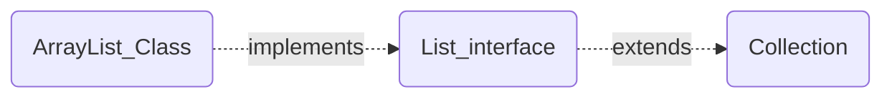

## 知识点

结构图如下：

List接口提供了一种存储有序集合的方法。它是[Collection](./collection.md)的子接口。它是对象的有序集合，可以在其中存储重复值。由于List保留插入顺序，因此它允许元素的位置访问和插入。

```mermaid
graph LR;
	A(ArrayList_Class) -.implements.-> B(List_interface)
	B(List_interface) -.extends.-> C(Collection)
```

